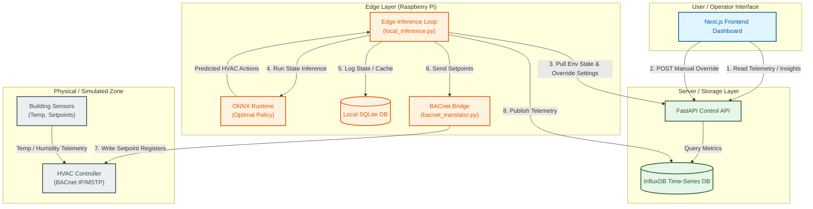

# EcoRetrofit-AI

      

AI-based HVAC setpoint optimization for small and medium commercial buildings using edge inference and live telemetry.

## Why This Project Matters
Commercial buildings often run static HVAC schedules that waste energy during low occupancy or changing weather. EcoRetrofit-AI adds an AI control layer on top of existing BMS infrastructure to reduce energy use while keeping indoor comfort within target bounds.

**Who benefits:**
* Building operators who need lower utility costs.
* Facility teams that want analytics and control visibility.
* SMEs that cannot fully replace legacy HVAC systems but can retrofit control logic.

## Tech Stack
* Python 3.11
* FastAPI (backend API)
* Next.js 16, React 19, TypeScript (dashboard)
* ONNX Runtime (edge inference)
* Stable-Baselines3 PPO + Sinergym (training/simulation)
* InfluxDB 2.7 (time-series telemetry)
* BACnet bridge via bacpypes3
* Docker and Docker Compose
* Target edge hardware: Raspberry Pi 4

## Architecture And Workflow

The system is split into three main layers: the **Client/Dashboard Layer**, the **Server/Storage Layer**, and the **Edge/Control Layer**.



### Core Workflows
1. **Edge Control Loop (BACnet)**: The `local_inference.py` script executes at regular intervals on the Raspberry Pi edge device. It pulls the latest zone temperature, ambient weather overlay, and active manual override status from the **FastAPI Control API**.
2. **AI Inference**: The edge script feeds normalized sensor data into the **ONNX Runtime** executing the trained reinforcement learning model. The model outputs HVAC setpoint shifts (e.g. heating/cooling Deadband shifts).
3. **BACnet Command**: The edge script translates the predicted action and sends commands via the **BACnet Bridge** to the physical/simulated **HVAC Controller**.
4. **Telemetry Logging**: The edge script writes telemetry points (actual/target temperatures, action selection, and system metrics) to **InfluxDB** and caches the state in a local SQLite DB for resilience.
5. **Dashboard Monitoring**: The **Next.js Dashboard** fetches time-series telemetry and real-time savings statistics from the FastAPI API (which queries InfluxDB) and allows building managers to toggle manual controls.

## Quickstart (Local Machine)

### 1. Clone the repository
```bash
git clone https://github.com/naimul214/EcoRetrofit-AI.git
cd EcoRetrofit-AI
```

### 2. Start telemetry storage (InfluxDB)
```bash
cd src/edge
# Copy .env.example to .env and set credentials
docker compose up -d influxdb
```

### 3. Run backend API
```bash
cd ../web/backend
python -m venv .venv
# On Windows:
.venv\Scripts\Activate.ps1
# On macOS/Linux:
# source .venv/bin/activate
pip install -r requirements.txt
# Copy .env.example to .env
python main.py
```

### 4. Run frontend dashboard
```bash
cd ../frontend
npm install
# Copy .env.example to .env.local
npm run dev
```

### 5. Run edge inference loop
```bash
cd ../../edge
python -m venv .venv
# On Windows:
.venv\Scripts\Activate.ps1
# On macOS/Linux:
# source .venv/bin/activate
pip install -r requirements.txt
python -u local_inference.py
```

Default local URLs:
* Backend: http://localhost:8010
* Frontend: http://localhost:3000
* InfluxDB: http://localhost:8086

## Results / Demo
* **Average Inference Latency on Edge Device:** ~1.2 ms
* **Reward / Energy Trend:** Estimated energy optimization of 12-18% over standard static rule-based scheduling during peak summer hours while maintaining thermal comfort bands.
* **Estimated Weekly Savings:** ~$85 - $120 CAD per small commercial zone (pricing models derived from Ontario Time-Of-Use pricing standards).

## Limitations And Future Work
* Current savings estimate is proxy-based and not yet calibrated with real utility billing data.
* Live control override/environment variables are persisted in a process-safe local database to prevent desynchronization in multi-worker environments.
* Training and simulation pipelines need tighter experiment tracking and versioned model registry integration.
* BACnet integration should include robust retry/backoff and richer failure classification for field deployments.

### Planned next steps:
* Add CI for linting, tests, and dependency checks.
* Add experiment tracking and model version metadata.
* Add integration tests for edge-to-backend-to-Influx pipeline.

## Connect
* **LinkedIn:** https://linkedin.com/in/naimul214
* **GitHub:** https://github.com/naimul214
